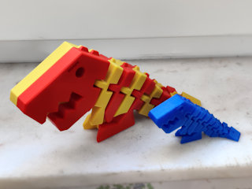

# Flexi Rex - separate parts for huge prints
*3D printable flexible T-rex, split up for separate printing of parts to be assembled into a huge model (formerly thing:2907805)*

### License
[Creative Commons - Attribution - Share Alike](https://creativecommons.org/licenses/by-sa/3.0/)

### Attribution
This started out as Kirbs' Flexi Rex ([Thingiverse thing:1759297](https://www.thingiverse.com/thing:1759297)), then remixed by airfish ([Thingiverse thing:2189652](https://www.thingiverse.com/thing:2189652)), and then by me ([thing:2738211, but now moved to GitHub](https://github.com/DrLex0/print3D-FlexiRex)).

### Gallery

[🔎](images/gallery1-frex.jpg) [🔎](images/gallery2-assembly.png) [🔎](images/gallery3-frex.jpg) [🔎](images/gallery4-parts.jpg)

## Description and Instructions

This is the [Flexi Rex](https://github.com/DrLex0/print3D-FlexiRex) split up into separate parts, intended for making really huge prints where the full model doesn't fit inside the printer.

This needs to be assembled in a specific order, either with dowels only or with glue to make it stronger. See the Post-printing section for instructions and an animation.

If you merely want to print the Flexi Rex at normal kids-hands-friendly-size scale that fits all printers, by all means use the original [print-in-place model](https://github.com/DrLex0/print3D-FlexiRex) because for that one, your printer can do all the hard assembly work for you!

## Printing

The parts are scaled 200% w.r.t. the original model but you'll probably want to further scale them up to the desired size. The head is the largest part, so use it as a reference if you really want to print as large as your printer can handle. On Thingiverse (if it isn't completely broken) you can [find some makes](https://www.thingiverse.com/thing:2907805/makes) that demonstrate how large you can go.

Given that this is intended to be printed big, you'll probably want to print this with your widest nozzle and thickest possible layers to save time. Do not rely on infill for strength, instead use many perimeters and top layers and the lowest infill that allows to properly seal the top layers. For the split pieces, you don't need many bottom layers because those sufaces will be internal and be either joined or glued together.

You can opt to print the head either in one piece or split like the rest. As shown in the assembly instructions, you need to start assembling with the head, which is why it can be printed as one piece. However if you want the model to have a uniform appearance without having to sand all the parts (or you want to create a chequered effect as in the photos), you should also print the head in two pieces so it has the same top layer finish at both sides.

Supports shouldn't be needed except maybe for the axle of the hinge on the single-piece head, depending on how big you're printing this and how well your printer can bridge gaps. If you're printing really huge, the arches of the links may also need supports.

For stability, use the lowest possible infill, especially for the head. I used 12% gyroid. Since the model has been updated to the more stable version, there is no real need anymore to use higher infill values for the lower parts, but if you really want to maximize stability, you can use a higher infill for the piece with the legs and the first tail piece behind it.

The parts have holes for optional **dowels** that allow to assemble the model without glue, and that also help to align the pieces when gluing them together. You need 19 copies of the dowel (you can omit one of the three in the head when using glue, 2 suffice for alignment).

Do not expect the dowels to fit right away if you merely print them at the exact same scale as the rest, because the tolerances on the parts will scale together with the whole model, I cannot provide tolerances that work for all scales. At smaller scales the uncorrected dowels will be way too tight, and at truly monstrous scales they will likely be too sloppy. To find the optimal size for the dowels, start by printing only one at the same scale as the other parts, and check whether it fits. If it is too tight, print it again at 98%, 96%, … size. If it is too sloppy, scale it up to 102%, 104%, … (Ideally you should only scale the X and Z axes, but this doesn't matter too much.) Repeat until you have a well-fitting dowel, then print the remaining ones at that same scale. Of course, a bit of sanding can also help if you're almost there. 
For gluing, it is best that the dowels are just tight enough such that the halves cannot move w.r.t. each other; for assembly without glue you will want the dowels to be pretty tight.

## Post-printing / Assembling

If you printed the head as one piece, one side will have a different finish than the other side and all other pieces because that side was laying on the print bed. To hide this and give all parts a uniform finish, you could sand their sides.

Start with the head and piece 1a, then put piece 1b on top. Then add 2a and put 2b on top, and so on.

Dowels will suffice if you're only going to use the model for display purposes, an advantage is that you could disassemble it again. If the model will have to withstand some abuse, glue is recommended.

If you're gluing the parts, do not apply an excessive amount of glue all across the entire surface, you don't want it to squirt out when pushing the parts together. Apply glue near the edges, not at the center. Don't forget to also apply some glue on the end of the shackles. I would recommend epoxy or another glue that has a curing time longer than a few seconds. I wouldn't use super glue (cyanoacrylate), because if you don't get the alignment right immediately, you risk ending up with a deformed and unusable Rex…

After gluing, you may need to apply a bit of sanding to hide the seam.

## Licensing, selling prints or derivatives of this model

This is released under the same CC BY-SA license as the print-in-place Flexi Rex it is derived from. [See the Flexi Rex repository for more details.](https://github.com/DrLex0/print3D-FlexiRex#license-clarification-read-this-before-contacting-me)

## History

### 2018/05/12
First published on Thingiverse.

### 2020/03/23
Migrated to GitHub.

### 2023/01/15
Updated model with the same stability and flexibility improvements as the print-in-place version, and added the option to align the parts with dowels.

## Tags
`assembly_required`, `dinosaur`, `Flexi`, `flexible`, `huge`, `large_print`, `t-rex`, `toy`, `Tyrannosaurus_Rex`
